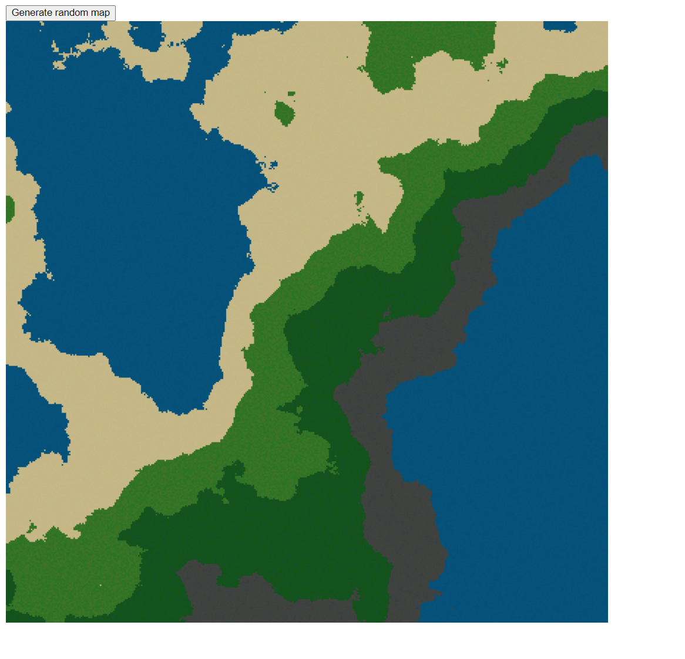
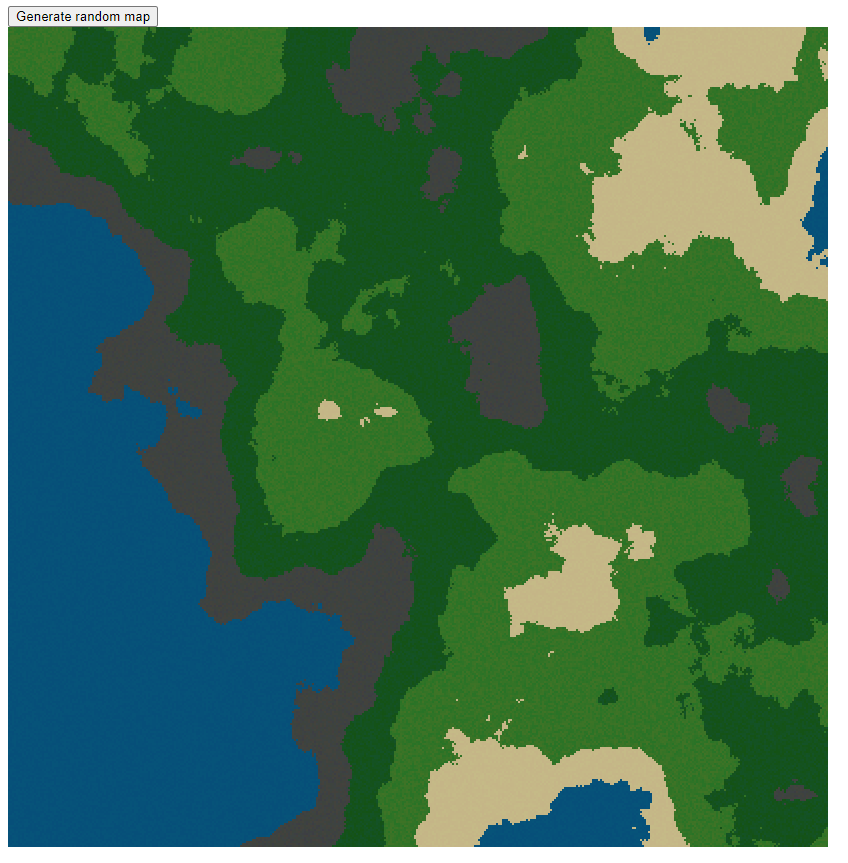

= Dokumentace - Generátor map

[.lead]
Zdroje:

https://en.wikipedia.org/wiki/Fractal_landscape +
https://en.wikipedia.org/wiki/Diamond-square_algorithm

[.lead]
Popis:

Tento program umí vygenerovat náhodný pixelový obrázek mapy pomocí fraktálů. Pro tvorbu fraktální krajiny je potřeba použít algoritmus, který napodobuje přírodně vytvořený terén. +
Algoritmus, který jsem použil pro tvorby této krajiny se jmenuje Diamond-square algorithm. Ten funguje tak, že máme čtverec, který rozdělíme na 4 menší stejně velké čtverečky, jejichž vrcholům dáme průměrnou hodnotu ze vrcholů, ze kterých byly vypočítány. +
Nakonec vrcholům, které mají podobnou hodnotu přiřadíme podobnou barvu.

[.lead]
Ovládání:

Mapa se na začátku načte automaticky a pokud chcete mapu znovu vygenerovat, můžete stisknout tlačítko 'Generate random map'.

[.lead]
Screenshoty:

